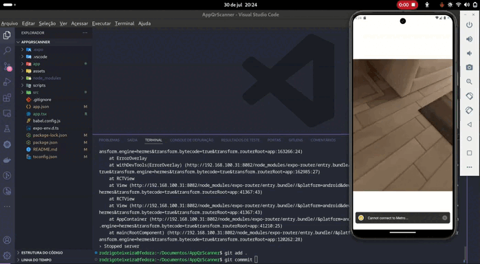

# Welcome to AppQrScanner 👋

This is an [Expo](https://expo.dev) project created with [`create-expo-app`](https://www.npmjs.com/package/create-expo-app).

# Sobre o projeto

Aplicação utilizando a camera do dispositivo para leitura de QRCODE.

 **</>Codelink**.

Aplicação utilizando framework react native.


## Layout mobile


# Tecnologias utilizadas
## Aplicação

- [Expo](https://docs.expo.dev/?utm_source=google&utm_medium=cpc&utm_content=search&gclid=CjwKCAjwxOymBhAFEiwAnodBLE4O6-g49a-HniPnrQt_l-6t_CNvui4z2_h31jUCUpesirHbFYmI_hoC39IQAvD_BwE)
- [TypeScript](https://www.typescriptlang.org/docs/)
- [styled-component](https://styled-components.com/docs/basics#installation)
- [Expo BarCodeScanner](https://docs.expo.dev/versions/latest/sdk/bar-code-scanner/)


## Get started

1. Install dependencies

   ```bash
   npm install
   ```

2. Start the app

   ```bash
    npx expo start
   ```

- [development build](https://docs.expo.dev/develop/development-builds/introduction/)
- [Android emulator](https://docs.expo.dev/workflow/android-studio-emulator/)
- [iOS simulator](https://docs.expo.dev/workflow/ios-simulator/)
- [Expo Go](https://expo.dev/go)

## Iniciando o projeto

Rodando o projeto 

```bash
npm run reset-project
```

## Para saber mais

Para saber mais sobre como desenvolver seu projeto com a Expo, consulte os seguintes recursos:

- [Expo documentation](https://docs.expo.dev/): Aprenda os fundamentos ou aprofunde-se em tópicos avançados com nossos [guias](https://docs.expo.dev/guides).
- [Learn Expo tutorial](https://docs.expo.dev/tutorial/introduction/): Siga o tutorial passo a passo onde você criará um projeto que roda em Android, iOS e na web.

